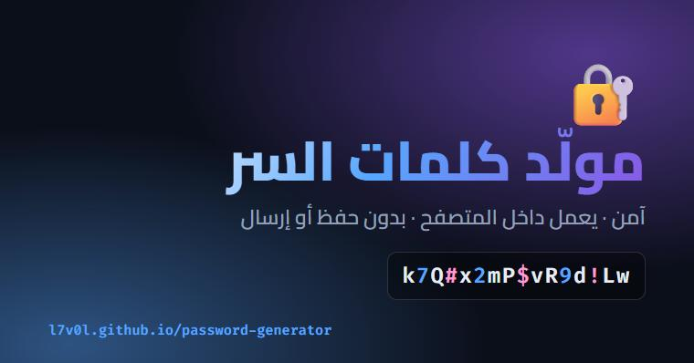

# 🔐 مولّد كلمات السر

مولّد كلمات سر آمن بواجهة عربية. يعمل بالكامل داخل متصفحك: لا يُرسل ولا يُحفظ أي شيء.

**[🚀 جرّبه الآن](https://l7v0l.github.io/password-generator/)**

## المميزات

- توليد بمصدر عشوائي مشفّر (`crypto.getRandomValues`) مع **أخذ عينات بالرفض** لتفادي التحيّز.
- الطول من 6 إلى 64، واختيار أنواع الأحرف: صغيرة، كبيرة، أرقام، رموز.
- ضمان وجود حرف من كل نوع تختاره.
- استبعاد الأحرف المتشابهة مثل `1 l I 0 O`.
- شريط قوة مع تقدير عدد البتات (الإنتروبي).
- نسخ بضغطة، وسجل لآخر 8 كلمات **في الجلسة فقط**.
- وضع فاتح وداكن، وتصميم متجاوب لكل الشاشات، ودعم RTL.
- اختصار: مسطرة المسافة لتوليد كلمة جديدة.

## الخصوصية

كل شيء يتم في المتصفح. لا سيرفر، ولا تتبع، ولا تخزين لكلمات السر. المحفوظ في المتصفح هو اختيار الوضع (فاتح/داكن) فقط.

## دعم المشروع

إذا أفادك المشروع، أعطه ⭐ من أعلى الصفحة. وأي اقتراح أو خطأ تلاحظه افتح عنه [Issue](https://github.com/l7v0l/password-generator/issues).

## الترخيص

MIT
